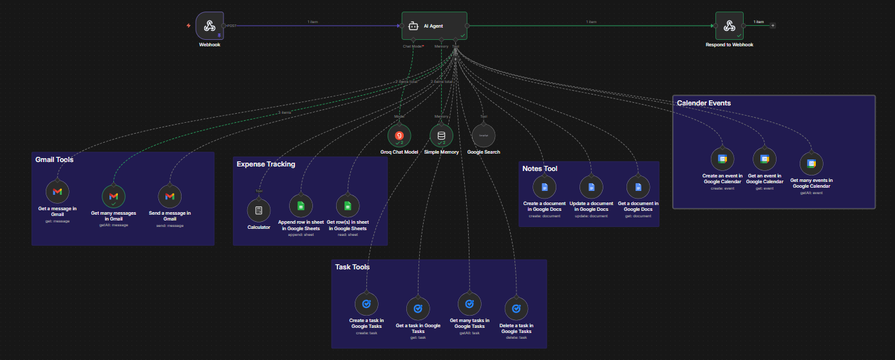

# 🤖 AI Productivity Agent (n8n + LLM Automation)

An **AI-powered productivity automation system** that uses an intelligent LLM Agent to manage emails, tasks, calendar events, notes, and expenses automatically.

Built using **n8n**, **LLM Agents**, and **Google Workspace APIs**, this project demonstrates how **Agentic AI systems** can orchestrate real-world workflows and act as a personal productivity assistant.

---

# 🚀 Project Overview

This project transforms an AI model into a **central automation controller** capable of understanding user requests and executing actions across multiple productivity tools.

Instead of manually switching between apps, users interact with a single AI agent that decides which tool to use and performs actions automatically.

The system is designed to explore **real-world Generative AI orchestration and workflow automation**.

---

# 🧩 System Architecture

```
                ┌────────────────────┐
                │      User Input    │
                │   (Webhook/API)    │
                └─────────┬──────────┘
                          │
                          ▼
                ┌────────────────────┐
                │      Webhook       │
                │     (Trigger)      │
                └─────────┬──────────┘
                          │
                          ▼
                ┌────────────────────┐
                │      AI Agent      │
                │   (LLM + Memory)   │
                └─────────┬──────────┘
                          │
        ┌─────────────────┼─────────────────┐
        │                 │                 │
        ▼                 ▼                 ▼
┌────────────────┐ ┌────────────────┐ ┌────────────────┐
│   Gmail Tools  │ │ Calendar Tools │ │   Task Tools   │
│ Read / Send    │ │ Create / Fetch │ │ Manage Tasks   │
└────────┬───────┘ └────────┬───────┘ └────────┬───────┘
         │                  │                  │
         └──────────────┬───┴────┬─────────────┘
                        ▼        ▼
              ┌────────────────────────┐
              │      Notes Tools       │
              │    Google Docs API     │
              └────────────┬───────────┘
                           │
                           ▼
              ┌────────────────────────┐
              │     Expense Tracking   │
              │   Google Sheets + Calc │
              └────────────┬───────────┘
                           │
                           ▼
                ┌────────────────────┐
                │   Respond Webhook  │
                │    (AI Response)   │
                └────────────────────┘
```

---

# ⚙️ How It Works

## Step 1 — Request Trigger

A user sends a request through a webhook or connected interface.

## Step 2 — AI Understanding

The AI agent analyzes intent using an LLM and conversation memory.

## Step 3 — Tool Selection

The agent dynamically selects the appropriate tool:

* Gmail
* Calendar
* Tasks
* Notes
* Expense Tracker

## Step 4 — Action Execution

n8n executes API operations based on AI decisions.

## Step 5 — Response Generation

The final structured output is returned via webhook response.

---

# ✨ Features

* 📧 Email automation using Gmail API
* 📅 AI-driven calendar scheduling
* ✅ Task creation and management
* 📝 Automated notes generation (Google Docs)
* 💰 Expense tracking with Google Sheets
* 🧠 Memory-enabled AI agent
* 🔗 Webhook-based API automation
* ⚡ Multi-tool orchestration via LLM
* 🧩 Modular workflow architecture

---

# 🛠 Tech Stack

* **n8n** — Workflow Automation Platform
* **LLM Agent** — Intelligent decision engine
* **Grok Chat Model / LLM API**
* **Google Gmail API**
* **Google Calendar API**
* **Google Tasks API**
* **Google Docs API**
* **Google Sheets API**
* **Webhook Integrations**

---

# 📨 Example Workflow

### Input

User request:

```
Create a meeting tomorrow at 10 AM and add a task reminder.
```

### AI Processing

* Detects scheduling intent
* Creates calendar event
* Adds task automatically
* Stores context in memory

### Output

AI executes actions and returns confirmation response.

---

# 📸 Workflow Preview


---

# 📦 Setup Instructions

## 1️⃣ Clone Repository

```bash
git clone https://github.com/your-username/ai-productivity-agent-n8n.git
```

---

## 2️⃣ Run n8n

### Using npm

```bash
npm install n8n -g
n8n start
```

### Using Docker

```bash
docker run -it --rm -p 5678:5678 n8nio/n8n
```

Open:

```
http://localhost:5678
```

---

## 3️⃣ Import Workflow

* Open n8n dashboard
* Import `workflow.json`

---

## 4️⃣ Configure Credentials

Add credentials inside n8n:

* Google OAuth (Gmail, Calendar, Docs, Sheets)
* LLM API Key
* Webhook configuration

⚠️ Never upload credentials to GitHub.

---

## 5️⃣ Activate Workflow

Trigger webhook → AI agent executes automation automatically.

---

# 🎯 Use Cases

* Personal AI productivity assistant
* Workflow automation system
* AI task & calendar manager
* Automation learning project
* Agentic AI demonstrations

---

# 🔮 Future Improvements

* 📊 Analytics dashboard
* 📱 WhatsApp integration
* 🧑‍💻 GitHub automation
* 🧠 Vector database memory
* 🔔 Smart notifications

---

# 👨‍💻 Author

**Jay Shimpi**

AI & Data Science Student 🚀

---

# ⭐ Support

If you found this project useful, consider giving it a ⭐ on GitHub!
